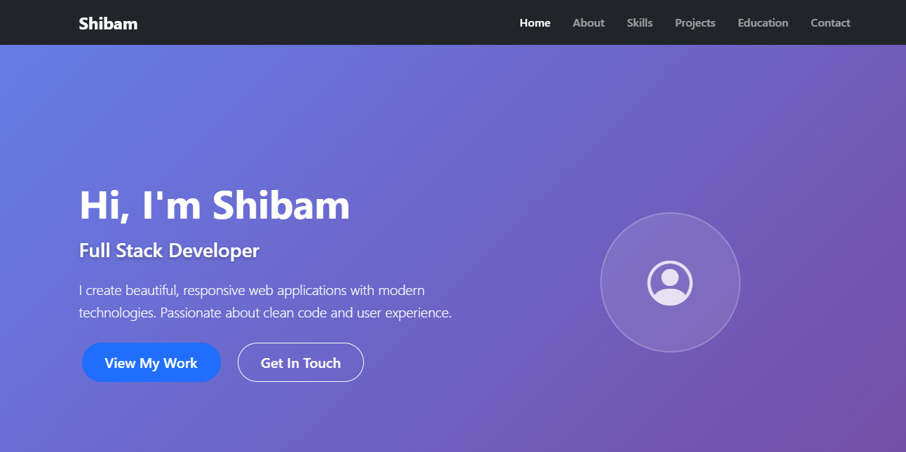

# 💼 Personal Portfolio Website


A clean, modern, and responsive personal portfolio website showcasing projects, skills, education, and contact information. Built with HTML5, CSS3, JavaScript, and Bootstrap 5.

## 📸 Screenshots

<div align="center">
  
  <p><em>Modern personal portfolio with gradient hero section and clean navigation</em></p>
</div>

## 🚀 Live Demo

[View Live Personal Portfolio Website](https://portfolio-shibam.vercel.app)

## 📋 Project Summary

This is a one-page personal portfolio website designed with a mobile-first approach. It features smooth scrolling navigation, interactive contact form with client-side validation, responsive design, and modern UI components. The website is optimized for performance and accessibility across all devices.

## 🛠️ Tech Stack

- **Frontend**: HTML5, CSS3, JavaScript (ES6+)
- **Framework**: Bootstrap 5.3.0
- **Icons**: Bootstrap Icons
- **Fonts**: System fonts (Segoe UI, Tahoma, Geneva, Verdana)
- **Deployment**: GitHub Pages

## ✨ Features

- **Responsive Design**: Mobile-first approach with seamless desktop experience
- **Smooth Scrolling**: Navigation with smooth scroll to sections
- **Interactive Contact Form**: Client-side validation with real-time feedback
- **Back to Top Button**: Appears on scroll for better navigation
- **Project Showcase**: Featured projects with live demo and source code links
- **Skills Section**: Organized skill categories with icons
- **Education Timeline**: Clean education history display
- **Modern UI**: Clean, minimal design with hover effects and animations
- **Cross-browser Compatible**: Works on all modern browsers
- **SEO Optimized**: Proper meta tags and semantic HTML structure

## 📁 Project Structure

```
portfolio-shibam/
├── 📄 index.html                 # Main HTML file
├── 🎨 styles.css                 # Custom CSS styles
├── ⚡ main.js                    # JavaScript functionality
├── 📸 screenshot/               # Project screenshots
│   └── portfolio-shibam.png
├── 📖 README.md                  # Project documentation
├── 📜 LICENSE                    # MIT License
├── 🚫 .gitignore                 # Git ignore file
├── 🚀 deploy_instructions.txt    # GitHub Pages deployment guide
└── ✅ REVIEWER_CHECKLIST.md      # Code review checklist
```

## 📝 Commit History

This project was developed through 7 key commits:

1. **init: add basic index.html and folder structure** - Initial project setup and basic file structure
2. **feat: add hero and about sections with responsive layout** - Hero section and about me content with responsive design
3. **feat: add projects section and project cards** - Project showcase with interactive cards and links
4. **feat: add contact form and validation** - Contact form implementation with client-side validation
5. **style: polish styles and mobile layout fixes** - CSS refinements and mobile responsiveness improvements
6. **docs: add README, screenshots, license** - Documentation, licensing, and project assets
7. **chore: final tweaks and accessibility fixes** - Final optimizations and accessibility enhancements

## 🏃‍♂️ How to Run Locally

1. **Clone the repository**
   ```bash
   git clone https://github.com/your-username/portfolio-shibam.git
   cd portfolio-shibam
   ```

2. **Open in browser**
   - Simply open `index.html` in your preferred web browser
   
   **Using VS Code Live Server extension:**
   - Install the Live Server extension
   - Right-click on `index.html` and select "Open with Live Server"

3. **View the website**
   - Open your browser and navigate to `http://localhost:8000` (or the port shown in terminal)

## 🚀 Deploy to GitHub Pages

Follow these steps to deploy your portfolio to GitHub Pages:

1. **Create a GitHub repository**
   - Go to GitHub and create a new repository
   - Name it `portfolio-shibam` or any name you prefer
   - Make it public for GitHub Pages to work

2. **Push your code**
   ```bash
   git init
   git add .
   git commit -m "Initial commit: Add portfolio website"
   git branch -M main
   git remote add origin https://github.com/your-username/portfolio-shibam.git
   git push -u origin main
   ```

3. **Enable GitHub Pages**
   - Go to your repository settings
   - Scroll down to "Pages" section
   - Select "Deploy from a branch"
   - Choose "main" branch and "/ (root)" folder
   - Click "Save"

4. **Access your live site**
   - Your site will be available at: `https://your-username.github.io/portfolio-shibam`
   - It may take a few minutes to deploy

For detailed deployment instructions, see `deploy_instructions.txt`.

## 🎨 Customization

### Updating Personal Information

1. **Hero Section**: Edit the name, role, and description in `index.html`
2. **About Section**: Update the about text to reflect your background
3. **Skills**: Modify the skills categories and technologies
4. **Projects**: Replace with your actual projects, including:
   - Project titles and descriptions
   - Technology stacks (badges)
   - Live demo and source code links
5. **Education**: Update with your educational background
6. **Contact**: Replace contact information and social links

### Styling Changes

- **Colors**: Update CSS custom properties in `:root` section of `styles.css`
- **Fonts**: Change font family in the CSS variables
- **Layout**: Modify Bootstrap classes or add custom CSS
- **Animations**: Adjust transition durations and effects

### Adding New Sections

1. Add HTML structure in `index.html`
2. Add corresponding navigation link
3. Style the section in `styles.css`
4. Update JavaScript if interactive functionality is needed

## 🧪 Testing Checklist

- [ ] **Mobile Responsiveness**: Test on various screen sizes
- [ ] **Navigation**: All links work and smooth scroll functions
- [ ] **Contact Form**: Validation works for all fields
- [ ] **Cross-browser**: Test on Chrome, Firefox, Safari, Edge
- [ ] **Performance**: Check loading speed and optimize images
- [ ] **Accessibility**: Verify keyboard navigation and screen reader compatibility
- [ ] **Console Errors**: No JavaScript errors in browser console

## 📚 What I Learned

Building this portfolio website was an excellent learning experience that reinforced several key web development concepts:

**Technical Skills:**
- **Responsive Design**: Implemented mobile-first CSS approach using Bootstrap's grid system and custom media queries
- **JavaScript DOM Manipulation**: Created interactive features like smooth scrolling, form validation, and dynamic navigation
- **CSS Animations**: Added subtle hover effects and scroll-triggered animations to enhance user experience
- **Form Validation**: Implemented comprehensive client-side validation with real-time feedback

**Best Practices:**
- **Semantic HTML**: Used proper HTML5 semantic elements for better accessibility and SEO
- **Code Organization**: Separated concerns with dedicated CSS and JavaScript files
- **Performance Optimization**: Minimized dependencies and optimized for fast loading
- **Git Workflow**: Followed conventional commit messages and proper version control

**Design Principles:**
- **User Experience**: Focused on intuitive navigation and clear information hierarchy
- **Visual Design**: Applied consistent spacing, typography, and color schemes
- **Accessibility**: Ensured keyboard navigation and screen reader compatibility

This project helped me understand the importance of planning, iterative development, and testing across different devices and browsers. It also reinforced the value of clean, maintainable code and proper documentation.

## 📄 License

This project is licensed under the MIT License - see the [LICENSE](LICENSE) file for details.

## 🤝 Contributing

1. Fork the repository
2. Create a feature branch (`git checkout -b feature/amazing-feature`)
3. Commit your changes (`git commit -m 'Add some amazing feature'`)
4. Push to the branch (`git push origin feature/amazing-feature`)
5. Open a Pull Request

## 📞 Contact

- **Email**: Connect-With-Shibam@outlook.com
- **LinkedIn**: [linkedin.com/in/shibam-webdev](https://linkedin.com/in/shibam-webdev)
- **GitHub**: [github.com/Shibam-Code-Pro](https://github.com/Shibam-Code-Pro)

---

⭐ If you found this project helpful, please give it a star on GitHub!
